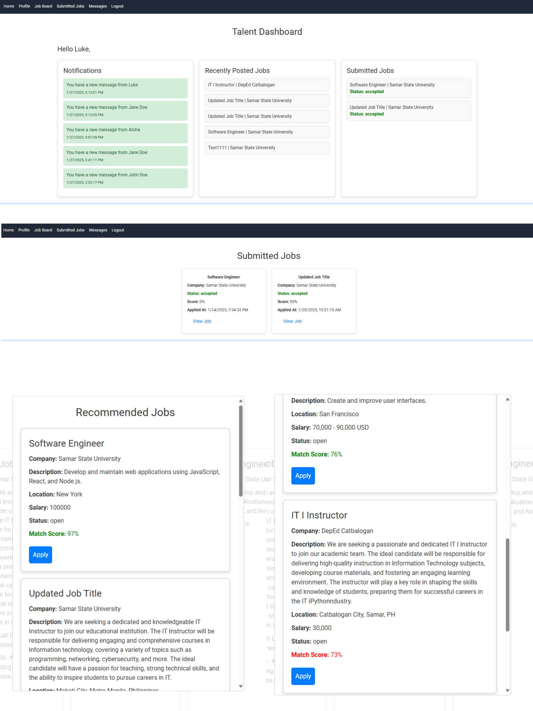

# SSU Career Connect

SSU Career Connect is a web-based platform designed to connect graduates of SSU with industry partners. It facilitates job outsourcing, real-time messaging, and notifications using Firebase and Azure Blob Storage for profile pictures.

## Features
- User authentication (signup & login system)
- Job postings and applications
- Real-time messaging and notifications using Firebase
- Profile picture management via Azure Blob Storage
- Secure JWT-based authentication
- Responsive UI with React and TailwindCSS
- AI-powered job recommendations using TensorFlow.js and Natural Language Processing
- Email notifications for job applications
- Drag-and-drop functionality for profile and resume management

## Installation

### Prerequisites
- Node.js (latest LTS version recommended)
- MongoDB Atlas account (or local MongoDB setup)
- Firebase project setup
- Azure Blob Storage account

📌 Step 1: Clone this repository

    git clone https://github.com/lukeperry/ssu-career-connect.git
    cd ssu-career-connect

📌 Step 2: Install backend dependencies

    yarn install

📌 Step 3: Install frontend dependencies

    cd client
    yarn install

📌 Step 4: Configure environment variables

Create a `.env` file in the root directory for the backend and copy the following:

    # MongoDB connection URI
    MONGODB_URI=mongodb+srv://<username>:<password>@<cluster-url>/<database-name>

    # JWT secret key for signing tokens (Use a strong, randomly generated key)
    JWT_SECRET=your_jwt_secret_key

    # Server port
    PORT=5000

    # Azure Blob Storage
    AZURE_STORAGE_CONNECTION_STRING=your_azure_storage_connection_string
    AZURE_STORAGE_CONTAINER_NAME=your_container_name

    # Email credentials for sending password reset emails
    EMAIL_USER=yourEmail@example.com
    EMAIL_PASS=yourEmailPassword

    # Azure Key Vault
    KEY_VAULT_NAME=your_key_vault_name
    FIREBASE_SERVICE_ACCOUNT_SECRET_NAME=your_firebase_secret_name
    AZURE_CLIENT_ID=your_azure_client_id
    AZURE_TENANT_ID=your_azure_tenant_id
    AZURE_CLIENT_SECRET=your_azure_client_secret

Create a `.env` file in the `client` directory for the frontend and copy the following:

    FAST_REFRESH=false
    SKIP_PREFLIGHT_CHECK=true
    CHOKIDAR_USEPOLLING=true
    WATCHPACK_POLLING=true
    WDS_SOCKET_HOST=127.0.0.1

    # API Backend Address
    REACT_APP_API_ADDRESS=https://your-backend-url.com

    # Firebase Configuration
    REACT_APP_FIREBASE_API_KEY=your_firebase_api_key
    REACT_APP_FIREBASE_AUTH_DOMAIN=your_firebase_auth_domain
    REACT_APP_FIREBASE_PROJECT_ID=your_firebase_project_id
    REACT_APP_FIREBASE_STORAGE_BUCKET=your_firebase_storage_bucket
    REACT_APP_FIREBASE_MESSAGING_SENDER_ID=your_firebase_messaging_sender_id
    REACT_APP_FIREBASE_APP_ID=your_firebase_app_id
    REACT_APP_FIREBASE_MEASUREMENT_ID=your_firebase_measurement_id

📌 Step 5: Start the backend server (in a separate bash)

    
    cd server
    yarn start

📌 Step 6: Start the frontend server (in a separate bash)

    cd client
    yarn start

📌 Step 7: Open the application

Open your browser and go to:

    http://localhost:3000

## Usage
- Signup/Login as a user
- Post and apply for jobs
- Chat in real-time with recruiters
- Manage and update your profile
- Upload resumes and profile pictures
- Receive AI-powered job recommendations

## Screenshots

## Technologies Used
### Backend
- Node.js
- Express.js
- MongoDB with Mongoose
- JWT Authentication
- Firebase Admin SDK
- Azure Blob Storage
- TensorFlow.js for AI job recommendations

### Frontend
- React.js
- TailwindCSS
- React Router
- Axios
- Firebase for real-time messaging
- Drag-and-drop UI for file uploads

## License
MIT License
